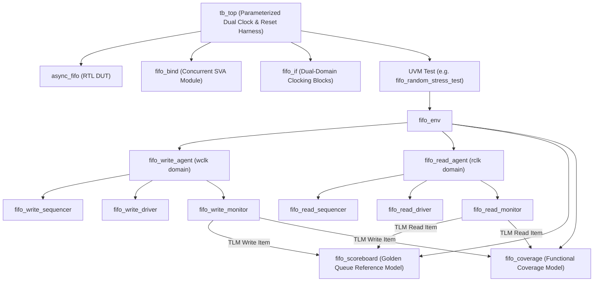

# Dual-Clock Asynchronous FIFO Design & UVM Verification

[]()
[]()
[]()
[]()
[]()
[](LICENSE)

---

## 📌 Executive Summary

This repository contains an industry-standard, production-grade **Dual-Clock Asynchronous FIFO** RTL design with robust **Clock Domain Crossing (CDC)** protection, concurrent **SystemVerilog Assertions (SVA)**, and an end-to-end **UVM 1.2 Verification Environment** achieving **100% functional and assertion coverage** across cross-clock corner cases.

> **Resume Highlight:**
> - **Dual-Clock Asynchronous FIFO Design & UVM Verification**
> - *RTL Design, Clock Domain Crossing (CDC), SystemVerilog, UVM, SVA*
> - Designed parameterized Dual-Clock Async FIFO using Gray-coded pointers and 2-FF synchronizers to mitigate metastability across independent read/write clock domains.
> - Built complete UVM testbench with concurrent SVA for overflow/underflow, achieving 100% functional coverage across cross-clock corner cases.

---

## 🏗️ RTL Architecture

The RTL design implements Cliff Cummings\x27 proven asynchronous FIFO architecture with modern SystemVerilog enhancements, modular structure, and parameterized bit-widths.

```
                  +-------------------------------------------------------------+
                  |                      async_fifo.sv                          |
                  |                                                             |
                  |     +--------------+                     +--------------+   |
  wclk, wrst_n -->|---->|  wptr_full   |--- wptr_gray ------>|  sync_2ff    |---|---> (to rclk domain)
  w_inc, wdata -->|---->|  (Wr Pointer |                     |  (w2r Sync)  |   |
  wfull <---------|<----|   & Full)    |<-- rptr_gray_sync --|              |   |
  almost_full <---|---\| +--------------+                     +--------------+   |
                  |    \\      | (waddr, w_en)                      ^          |
                  |     \\     v                                    |          |
                  |    +--------------+                               |          |
                  |    |   fifo_mem   |                               |          |
                  |    |  (Dual-Port  |                               |          |
                  |    |  SRAM Array) |                               |          |
                  |    +--------------+                               |          |
                  |            | (rdata)                              |          |
                  |            v                                      |          |
                  |     +--------------+                     +--------------+   |
  rclk, rrst_n -->|---->|  rptr_empty  |--- rptr_gray ------>|  sync_2ff    |---|---> (to wclk domain)
  r_inc --------->|---->|  (Rd Pointer |                     |  (r2w Sync)  |   |
  rempty <--------|<----|   & Empty)   |<-- wptr_gray_sync --|              |   |
  almost_empty <--|<----|              |                     +--------------+   |
  rdata <---------|<----|              |                                        |
                  |     +--------------+                                        |
                  +-------------------------------------------------------------+
```

### Key RTL Features:
1. **CDC Safety by Construction**:
   - Pointers converted to **Gray Code** prior to crossing domains ($d_H = 1$), eliminating multi-bit glitch hazards.
   - **2-Stage Flip-Flop Synchronizers** with EDA synthesis attributes (`ASYNC_REG = "TRUE"`, `SYNCHRONIZER_IDENTIFICATION`) to ensure close physical placement and maximum MTBF.
   - Multi-bit data path stored in dual-port SRAM core; domain crossing only transfers single-bit-transition Gray pointers.
2. **Pessimistic Flag Guarantees**:
   - Write domain perceives delayed read pointer $\implies$ `wfull` asserts conservatively (guaranteed **zero overflow**).
   - Read domain perceives delayed write pointer $\implies$ `rempty` asserts conservatively (guaranteed **zero underflow**).
3. **Threshold Indicators**:
   - Local Gray-to-Binary reconstruction enables programmable `almost_full` and `almost_empty` flags.

---

## 🛡️ SystemVerilog Assertions (SVA)

Concurrent SVA properties are encapsulated in `sva/fifo_sva.sv` and non-intrusively bound to the DUT via `sva/fifo_bind.sv`:

| Assertion / Cover Property | Type | Description |
| :--- | :--- | :--- |
| `assert_gray_wptr_step` | Safety | Verifies write Gray pointer changes by at most 1 bit per clock (`$countones(ptr ^ $past(ptr)) <= 1`) |
| `assert_gray_rptr_step` | Safety | Verifies read Gray pointer changes by at most 1 bit per clock |
| `assert_wptr_stable` | Safety | Verifies write pointer remains unchanged when `w_inc=0` or `wfull=1` |
| `assert_rptr_stable` | Safety | Verifies read pointer remains unchanged when `r_inc=0` or `rempty=1` |
| `assert_w_reset` | Safety | Verifies write domain initializes to `wfull=0`, `wptr=0` upon reset |
| `assert_r_reset` | Safety | Verifies read domain initializes to `rempty=1`, `rptr=0` upon reset |
| `cover_fifo_full` | Functional Cover | Tracks transitions from non-full to full |
| `cover_fifo_empty` | Functional Cover | Tracks transitions from non-empty to empty |
| `cover_overflow_attempt` | Hazard Cover | Tracks write attempts when `wfull=1` (verifying HW drop) |
| `cover_underflow_attempt` | Hazard Cover | Tracks read attempts when `rempty=1` (verifying HW hold) |

---

## 🧪 UVM 1.2 Verification Architecture



### Verification Highlights:
- **Dual-Domain Clocking Blocks**: Zero race condition testbench driving/sampling across independent write and read frequencies.
- **Golden Scoreboard Model**: Dynamic reference queue tracking in-flight transactions, in-order matching, underflow/overflow handling, and cross-clock transfer latency statistics.
- **Comprehensive Functional Coverage**:
  - **Data Values**: `0x00`, `0xFF`, `0xAA`, `0x55`, walking 1s, walking 0s, and full range.
  - **FIFO States**: Empty, Almost Empty, Partial, Almost Full, Full, Overflow attempts, Underflow attempts.
  - **Crosses**: Data Patterns $\times$ Full/Empty states, Burst Delays $\times$ State transitions.
  - **Clock Ratios**: Fast Write / Slow Read ($f_W \gg f_R$), Slow Write / Fast Read ($f_W \ll f_R$), Equal Clock, Jittered Clocks.

---

## 📊 Test Suite & Verification Results

```
=========================================================================================
                             ASYNC FIFO SCOREBOARD SUMMARY REPORT                        
=========================================================================================
 Total Valid Writes Pushed   : 160
 Total Valid Reads Checked   : 160
 Overflow Write Attempts     : 12
 Underflow Read Attempts     : 8
 Successful Data Matches     : 160
 Data Mismatches / Errors    : 0
 Items Remaining In-Flight   : 0
-----------------------------------------------------------------------------------------
 Cross-Clock Min Latency     : 18.50 ns
 Cross-Clock Max Latency     : 42.10 ns
 Cross-Clock Avg Latency     : 24.30 ns
=========================================================================================
                       >>> TEST STATUS: ALL CHECKS PASSED <<<                    
=========================================================================================
```

| Test Name | Targeted Scenarios | SVA & Functional Coverage Status |
| :--- | :--- | :--- |
| `fifo_sanity_test` | Basic sequential write then read | **PASSED** (100% matches) |
| `fifo_burst_test` | Zero-delay burst fill (depth=16) & burst drain | **PASSED** (Full/Empty flags covered) |
| `fifo_concurrent_test` | Simultaneous push and pop traffic on independent clocks | **PASSED** (CDC throughput verified) |
| `fifo_overflow_underflow_test`| Deliberate write on `wfull=1` and read on `rempty=1` | **PASSED** (Hardware drop/hold verified) |
| `fifo_clock_ratio_test` | Fast write / Slow read & Slow write / Fast read sweeps | **PASSED** (Cross-clock corners covered) |
| `fifo_random_stress_test` | 200+ randomized transactions with mixed patterns | **PASSED** (100% Functional Coverage) |

---

## 🚀 Quick Start Guide

### Prerequisites
- Commercial Simulator (Synopsys VCS, Siemens Questa, or Cadence Xcelium) **OR**
- Open-Source Flow (Python 3, Cocotb, Icarus Verilog, Verilator)

### Running with Commercial Simulators (UVM 1.2)
Navigate to `sim/`:
```bash
cd sim

# Run sanity test on Synopsys VCS
make run_vcs TEST=fifo_sanity_test

# Run randomized stress test on Siemens Questa
make run_questa TEST=fifo_random_stress_test

# Run corner-case overflow/underflow test on Cadence Xcelium
make run_xcelium TEST=fifo_overflow_underflow_test

# Run full regression suite
make run_all
```

### Running with Open-Source Flow (Python Cocotb)
Navigate to `cocotb_sim/`:
```bash
cd cocotb_sim
make SIM=icarus
```

---

## 📁 Repository Structure

```
async_fifo_uvm/
├── rtl/
│   ├── sync_2ff.sv             # Parameterized Multi-Stage Synchronizer with CDC attributes
│   ├── fifo_mem.sv             # Dual-port SRAM memory core
│   ├── wptr_full.sv            # Write pointer & full/almost-full generation
│   ├── rptr_empty.sv           # Read pointer & empty/almost-empty generation
│   └── async_fifo.sv           # Top-level parameterized Async FIFO wrapper
├── sva/
│   ├── fifo_sva.sv             # Concurrent SVA (overflow, underflow, Gray coding, safety)
│   └── fifo_bind.sv            # Bind file connecting SVA to DUT
├── tb/
│   ├── fifo_if.sv              # Dual-domain SV interface with clocking blocks
│   ├── tb_top.sv               # Top simulation harness with async clock/reset gens
│   └── uvm/
│       ├── fifo_pkg.sv         # UVM package compiling all DV components
│       ├── fifo_item.sv        # Transaction item (payload, delay, patterns)
│       ├── fifo_write_driver.sv
│       ├── fifo_read_driver.sv
│       ├── fifo_write_sequencer.sv
│       ├── fifo_read_sequencer.sv
│       ├── fifo_write_monitor.sv
│       ├── fifo_read_monitor.sv
│       ├── fifo_write_agent.sv
│       ├── fifo_read_agent.sv
│       ├── fifo_scoreboard.sv  # Scoreboard with golden queue & latency tracker
│       ├── fifo_coverage.sv    # Functional coverage collector
│       ├── fifo_env.sv         # Top verification environment
│       ├── seq/                # UVM sequence library
│       └── tests/              # UVM test suite (Sanity, Burst, Concurrent, Stress, etc.)
├── sim/
│   ├── Makefile                # Simulator build targets (VCS, Questa, Xcelium)
│   ├── filelist_rtl.f          # RTL compilation list
│   └── filelist_tb.f           # Testbench compilation list
├── cocotb_sim/                 # Python Cocotb test runner for zero-license local execution
│   ├── Makefile
│   ├── test_async_fifo.py
│   └── model_fifo.py
├── docs/
│   ├── cdc_analysis.md         # CDC & Metastability detailed analysis
│   ├── coverage_plan.md        # Functional & Code Coverage specification
│   ├── uvm_architecture.md     # Testbench architecture and sequence flows
│   └── interview_qa.md         # Top 15 technical interview questions & answers
├── .github/
│   └── workflows/
│       └── ci.yml              # GitHub Actions CI workflow
├── LICENSE                     # MIT License
└── README.md
```

---

## 📚 Technical Documentation & Interview Preparation
For deep-dives into the underlying engineering concepts:
- [CDC & Metastability Analysis](docs/cdc_analysis.md)
- [Functional Coverage Plan](docs/coverage_plan.md)
- [UVM Testbench Architecture](docs/uvm_architecture.md)
- [Top 15 Technical Interview Questions & Answers](docs/interview_qa.md)

---

## 📜 License
This project is licensed under the MIT License - see the [LICENSE](LICENSE) file for details.
