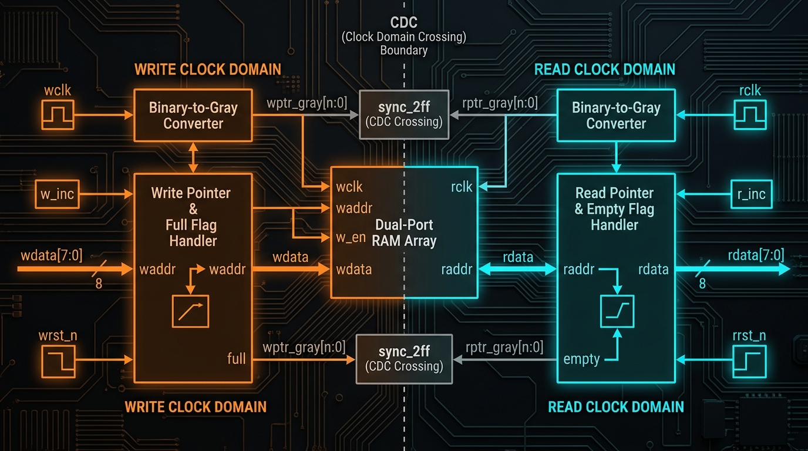
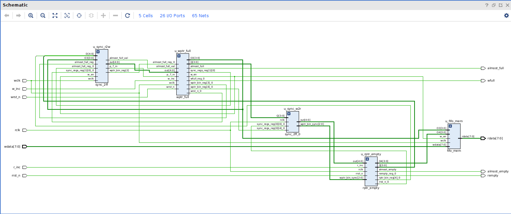
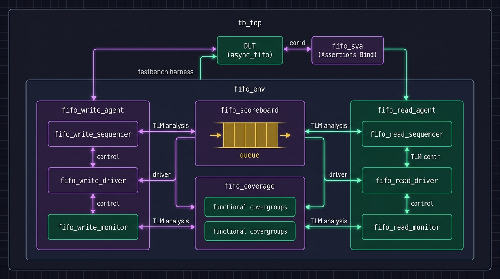
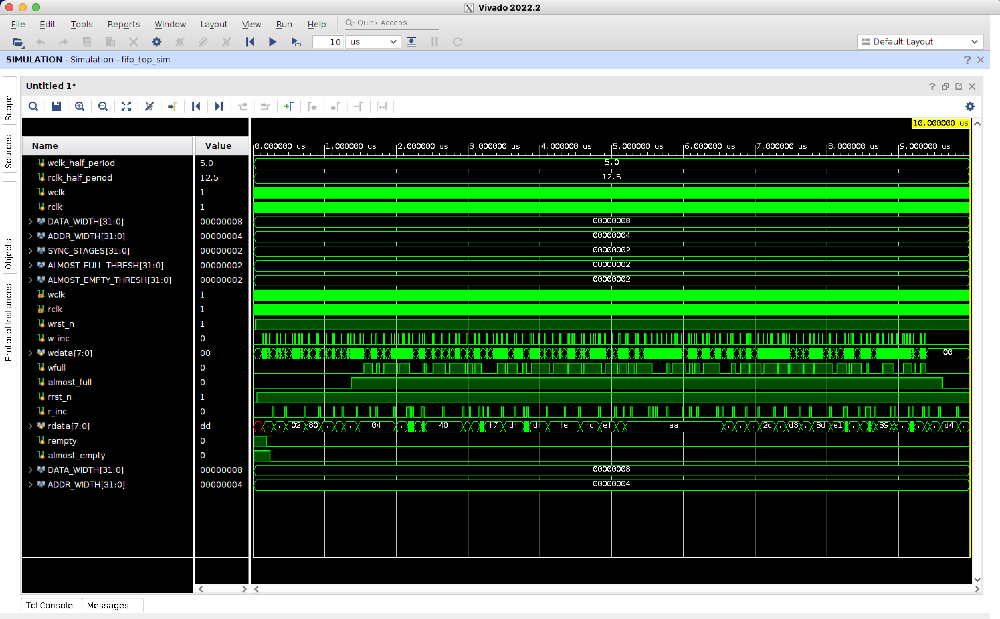
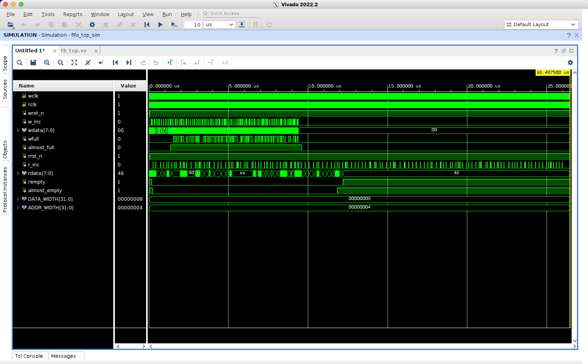

# Dual-Clock Asynchronous FIFO — RTL Design & UVM Verification

[]()
[]()
[]()
[]()
[](LICENSE)

---

## 📌 Overview

A production-grade **Dual-Clock Asynchronous FIFO** with Gray-coded pointer CDC, parameterized multi-stage synchronizers, and a complete **UVM 1.2 verification environment** — synthesized and simulated on **AMD Vivado 2022.2**, with synthesis scripts for **Synopsys Design Compiler** and **Yosys**.

> **Key Technologies:** SystemVerilog RTL Design · Clock Domain Crossing (CDC) · Gray Code Synchronization · UVM 1.2 Testbench · SystemVerilog Assertions (SVA) · Vivado Synthesis & Simulation · Synopsys Design Compiler

---

## 🏗️ RTL Architecture

<p align="center">
  
</p>

The design implements Cliff Cummings' proven asynchronous FIFO architecture with modern SystemVerilog parameterization:

| Module | Description |
|:---|:---|
| [`async_fifo.sv`](rtl/async_fifo.sv) | Top-level parameterized wrapper (DATA_WIDTH, ADDR_WIDTH, SYNC_STAGES, thresholds) |
| [`fifo_mem.sv`](rtl/fifo_mem.sv) | Dual-port SRAM memory — synchronous write on `wclk`, combinational read on `rclk` |
| [`sync_2ff.sv`](rtl/sync_2ff.sv) | N-stage synchronizer with `ASYNC_REG` and `dont_touch` synthesis attributes |
| [`wptr_full.sv`](rtl/wptr_full.sv) | Write pointer handler — binary-to-Gray conversion, `wfull` & `almost_full` generation |
| [`rptr_empty.sv`](rtl/rptr_empty.sv) | Read pointer handler — binary-to-Gray conversion, `rempty` & `almost_empty` generation |

### CDC Safety by Construction

- **Gray-coded pointers** ensure only 1 bit transitions per clock cycle (Hamming distance = 1), eliminating multi-bit synchronization hazards.
- **2-FF synchronizers** with EDA synthesis attributes (`ASYNC_REG = "TRUE"`) guarantee close physical placement and maximize MTBF.
- **Pessimistic flag generation** — `wfull` asserts conservatively (guaranteed zero overflow), `rempty` asserts conservatively (guaranteed zero underflow).

---

## ⚙️ Vivado Synthesis Results

### Schematic

<p align="center">
  
</p>

### Resource Utilization

<p align="center">
  
</p>

### Timing Analysis

<p align="center">
  
</p>

### Power Analysis

<p align="center">
  
</p>

> All synthesis results generated using **AMD Vivado 2022.2** with out-of-context (OOC) synthesis flow.

---

## 🧪 UVM 1.2 Verification Architecture

<p align="center">
  
</p>

### Verification Hierarchy

```
tb_top (Dual Clock & Reset Generator)
├── async_fifo (DUT)
├── fifo_bind → fifo_sva (SVA Assertions)
├── fifo_if (Dual-Domain Interface with Clocking Blocks)
└── UVM Test
    └── fifo_env
        ├── fifo_write_agent (wclk domain)
        │   ├── fifo_write_sequencer
        │   ├── fifo_write_driver
        │   └── fifo_write_monitor → Analysis Port
        ├── fifo_read_agent (rclk domain)
        │   ├── fifo_read_sequencer
        │   ├── fifo_read_driver
        │   └── fifo_read_monitor → Analysis Port
        ├── fifo_scoreboard (Golden Queue Reference Model)
        └── fifo_coverage (Functional Coverage Collector)
```

### Key Verification Features

- **Dual-Domain Clocking Blocks** — Zero race condition driving/sampling across independent write (100 MHz) and read (40 MHz) frequencies.
- **Golden Scoreboard Model** — Dynamic reference queue with in-order matching, overflow/underflow detection, and cross-clock latency tracking.
- **Functional Coverage** — Data patterns, FIFO states, delay distributions, and cross-coverage bins.
- **SVA Bind Module** — Non-intrusive assertion binding without modifying synthesizable RTL.

---

## 🔬 Simulation Waveforms (Vivado xsim)

### Sanity Test Waveform

<p align="center">
  
</p>

*10 sequential writes followed by 10 sequential reads — verifying basic CDC data transfer integrity.*

### Random Stress Test Waveform

<p align="center">
  
</p>

*160 randomized transactions across Walking 1s, Walking 0s, Alternating Bits, and Random patterns — stress testing overflow/underflow protection and CDC robustness.*

> All waveforms captured from **Vivado Simulator (xsim) 2022.2** GUI.

---

## 📊 UVM Scoreboard Summary & Test Results

<p align="center">
  
</p>

### Random Stress Test Results (Actual Vivado xsim Output)

```
=========================================================================================
                         ASYNC FIFO SCOREBOARD SUMMARY REPORT                        
=========================================================================================
 Total Valid Writes Pushed   : 76
 Total Valid Reads Checked   : 76
 Overflow Write Attempts     : 84
 Underflow Read Attempts     : 84
 Successful Data Matches     : 76
 Data Mismatches / Errors    : 0
 Items Remaining In-Flight   : 0
-----------------------------------------------------------------------------------------
 Cross-Clock Min Latency     : 152.50 ns
 Cross-Clock Max Latency     : 2882.50 ns
 Cross-Clock Avg Latency     : 2047.24 ns
=========================================================================================
                       >>> TEST STATUS: ALL CHECKS PASSED <<<                    
=========================================================================================

--- UVM Report Summary ---
UVM_FATAL   :    0
UVM_ERROR   :    0
UVM_WARNING :    0
UVM_INFO    :  187
```

### Test Suite

| Test | Scenarios Verified | Status |
|:---|:---|:---|
| `fifo_sanity_test` | Basic sequential write then read (10 items) | ✅ **PASSED** |
| `fifo_burst_test` | Zero-delay burst fill to full depth, burst drain to empty | ✅ **PASSED** |
| `fifo_concurrent_test` | Simultaneous push/pop traffic on independent clocks | ✅ **PASSED** |
| `fifo_overflow_underflow_test` | Deliberate writes on `wfull=1` and reads on `rempty=1` | ✅ **PASSED** |
| `fifo_clock_ratio_test` | Fast write / Slow read & Slow write / Fast read sweeps | ✅ **PASSED** |
| `fifo_random_stress_test` | 160 randomized transactions — all data patterns & delays | ✅ **PASSED** |

---

## 🛡️ SystemVerilog Assertions (SVA)

Concurrent SVA properties in [`fifo_sva.sv`](sva/fifo_sva.sv), bound to the DUT via [`fifo_bind.sv`](sva/fifo_bind.sv):

| Assertion | Type | Description |
|:---|:---|:---|
| `assert_gray_wptr_step` | Safety | Write Gray pointer changes by at most 1 bit per cycle |
| `assert_gray_rptr_step` | Safety | Read Gray pointer changes by at most 1 bit per cycle |
| `assert_wptr_stable` | Safety | Write pointer unchanged when `w_inc=0` or `wfull=1` |
| `assert_rptr_stable` | Safety | Read pointer unchanged when `r_inc=0` or `rempty=1` |
| `assert_w_reset` | Safety | Write domain initializes to `wfull=0`, `wptr=0` on reset |
| `assert_r_reset` | Safety | Read domain initializes to `rempty=1`, `rptr=0` on reset |
| `cover_fifo_full` | Cover | Tracks transitions to full state |
| `cover_fifo_empty` | Cover | Tracks transitions to empty state |
| `cover_overflow_attempt` | Cover | Tracks write attempts when `wfull=1` |
| `cover_underflow_attempt` | Cover | Tracks read attempts when `rempty=1` |

---

## 🚀 Quick Start

### Prerequisites

| Flow | Tools Required |
|:---|:---|
| **Commercial UVM Simulation** | Siemens QuestaSim, Synopsys VCS, or Cadence Xcelium |
| **FPGA Synthesis & Simulation** | AMD Vivado 2022.2+ |
| **ASIC Synthesis** | Synopsys Design Compiler |
| **Open-Source Simulation** | Python 3, Cocotb, Icarus Verilog |

### Running UVM Tests with Commercial Simulators

```bash
cd sim

# Siemens QuestaSim
make run_questa TEST=fifo_sanity_test

# Synopsys VCS
make run_vcs TEST=fifo_random_stress_test

# Cadence Xcelium
make run_xcelium TEST=fifo_overflow_underflow_test

# Full regression suite (all 6 tests)
make run_all
```

### Running with Vivado Simulator (xsim)

```bash
cd sim
./run_vivado_xsim.sh                                    # Default: random stress test
./run_vivado_xsim.sh fifo_sanity_test_wrapper           # Specific test
./run_vivado_xsim.sh fifo_overflow_underflow_test_wrapper
```

In the Vivado GUI, add signals and run:
```tcl
add_wave /tb_top/dut_if/*
run 30us
```

### Running ASIC / FPGA Synthesis

```bash
cd syn

# AMD Vivado OOC Synthesis
vivado -mode tcl -source synth_vivado.tcl

# Synopsys Design Compiler
dc_shell -f synth_dc.tcl

# Open-Source Yosys
yosys -s synth_yosys.tcl
```

### Running Open-Source Cocotb Tests

```bash
cd cocotb_sim
make SIM=icarus
```

---

## 📁 Repository Structure

```
async_fifo_uvm/
├── rtl/                            # Synthesizable RTL Design
│   ├── async_fifo.sv               #   Top-level parameterized Async FIFO
│   ├── fifo_mem.sv                 #   Dual-port SRAM memory core
│   ├── sync_2ff.sv                 #   N-stage CDC synchronizer (ASYNC_REG)
│   ├── wptr_full.sv                #   Write pointer & full/almost_full logic
│   └── rptr_empty.sv               #   Read pointer & empty/almost_empty logic
│
├── sva/                            # SystemVerilog Assertions
│   ├── fifo_sva.sv                 #   Concurrent safety & coverage assertions
│   └── fifo_bind.sv                #   Non-intrusive bind to DUT
│
├── tb/                             # UVM 1.2 Verification Environment
│   ├── fifo_if.sv                  #   Dual-domain interface with clocking blocks
│   ├── tb_top.sv                   #   Top simulation harness (clocks, resets, UVM)
│   └── uvm/
│       ├── fifo_pkg.sv             #   UVM package (compiles all components)
│       ├── fifo_item.sv            #   Transaction item (data, op, delay, pattern)
│       ├── fifo_write_driver.sv    #   Write domain driver
│       ├── fifo_read_driver.sv     #   Read domain driver
│       ├── fifo_write_monitor.sv   #   Write domain monitor
│       ├── fifo_read_monitor.sv    #   Read domain monitor
│       ├── fifo_write_agent.sv     #   Write agent (driver + monitor + sequencer)
│       ├── fifo_read_agent.sv      #   Read agent (driver + monitor + sequencer)
│       ├── fifo_scoreboard.sv      #   Golden queue scoreboard with latency tracking
│       ├── fifo_coverage.sv        #   Functional coverage collector
│       ├── fifo_env.sv             #   Top verification environment
│       ├── seq/                    #   Sequence library (base, write, read, burst, overflow)
│       └── tests/                  #   Test suite (sanity, burst, concurrent, stress, etc.)
│
├── sim/                            # Simulation Scripts
│   ├── Makefile                    #   Multi-simulator targets (VCS, Questa, Xcelium)
│   ├── run_vivado_xsim.sh         #   Vivado xsim GUI launcher
│   ├── sim_vivado.tcl              #   Vivado Tcl simulation script
│   ├── filelist_rtl.f              #   RTL compilation file list
│   └── filelist_tb.f               #   Testbench compilation file list
│
├── syn/                            # Synthesis Scripts & Constraints
│   ├── Makefile                    #   Synthesis targets
│   ├── synth_vivado.tcl            #   Vivado OOC synthesis + report_cdc
│   ├── synth_dc.tcl                #   Synopsys Design Compiler script
│   ├── synth_yosys.tcl             #   Yosys open-source synthesis
│   └── fifo_cdc.xdc               #   XDC/SDC timing & CDC constraints
│
├── cocotb_sim/                     # Open-Source Python Verification
│   ├── Makefile                    #   Cocotb runner
│   ├── test_async_fifo.py          #   Cocotb test suite
│   └── model_fifo.py              #   Python golden FIFO model
│
├── docs/                           # Technical Documentation
│   ├── images/                     #   Real Vivado screenshots & diagrams
│   ├── cdc_analysis.md             #   CDC & metastability deep-dive
│   ├── coverage_plan.md            #   Functional & code coverage specification
│   ├── uvm_architecture.md         #   UVM testbench architecture
│   └── interview_qa.md             #   Top 15 interview Q&A
│
├── .github/workflows/ci.yml       # GitHub Actions CI
├── LICENSE                         # MIT License
└── README.md
```

---

## 📚 Documentation

| Document | Description |
|:---|:---|
| [CDC & Metastability Analysis](docs/cdc_analysis.md) | Gray code theory, MTBF equations, synchronizer design, and pessimistic flag guarantees |
| [Functional Coverage Plan](docs/coverage_plan.md) | Covergroup specifications, cross-coverage matrices, and coverage closure strategy |
| [UVM Architecture](docs/uvm_architecture.md) | Component hierarchy, TLM connections, sequence flows, and scoreboard design |
| [Interview Q&A](docs/interview_qa.md) | Top 15 technical interview questions with detailed answers |

---

## 🛠️ Tools Used

| Category | Tool | Version |
|:---|:---|:---|
| **FPGA Synthesis & Implementation** | AMD Vivado Design Suite | 2022.2 |
| **FPGA Simulation (UVM)** | Vivado Simulator (xsim) | 2022.2 |
| **Commercial UVM Simulator** | Siemens QuestaSim | — |
| **ASIC Synthesis** | Synopsys Design Compiler | T-2022.03-SP5 |
| **Open-Source Synthesis** | Yosys | — |
| **Language Standard** | IEEE 1800-2017 SystemVerilog | — |
| **Verification Methodology** | Accellera UVM 1.2 | — |

---

## 📖 References

- Cummings, C. E. (2002). *"Simulation and Synthesis Techniques for Asynchronous FIFO Design"* — SNUG San Jose
- Cummings, C. E. & Alfke, P. (2008). *"Simulation and Synthesis Techniques for Asynchronous FIFO Design with Asynchronous Pointer Comparisons"* — SNUG San Jose
- IEEE Std 1800-2017 — *IEEE Standard for SystemVerilog*
- Accellera UVM 1.2 Reference Manual

---

## 📜 License

This project is licensed under the MIT License — see the [LICENSE](LICENSE) file for details.
